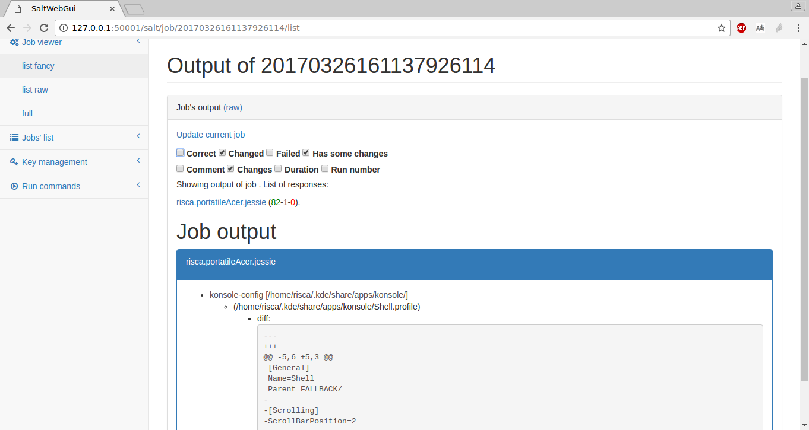

User manual
===========

Here a quick overview of functionality by screenshots.

Welcome to homepage!

.. image:: homepage.png

From the homepage go to the login view (link at the right on the top bar) and perform a login:

Here we are on the panel view!

.. image:: panel.png

From here first let's update the Job list (option on the left menu under *Jobs' list > Update JOBS*).
You will be redirect back to a list of performed jobs:

.. image:: jobslist.png

(the table is interactive for searching and sorting)

Let's try to run an highstate job. Enter the *run* view at the bottom of the left menu, insert the target and run:

.. image:: run.png

After performing the job, go back to the jobs' list in order to open the launched job and see the output of the execution.
If the job is still running nothing will be shown, just wait a little and update the view itself.
See below here an example of the visualization of the job result (it's live filterable by output state):

